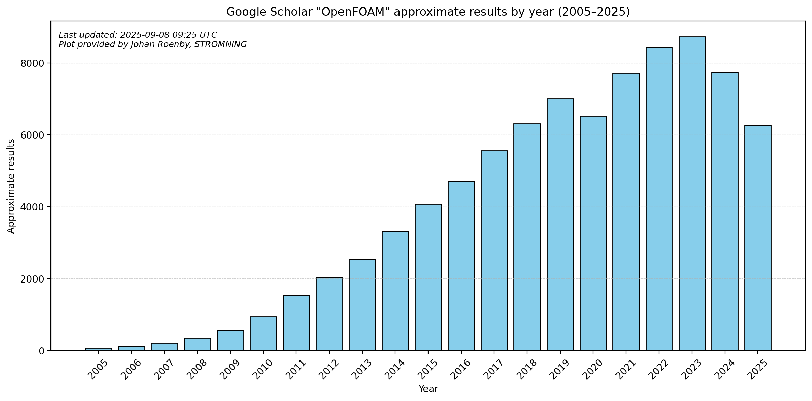

# OpenFOAM Google Scholar Trends

This repository tracks the approximate number of publications mentioning **OpenFOAM** on Google Scholar, per year from 2005 until today.

The numbers are collected by [`scholar_counts.py`](./scholar_counts.py), which queries Google Scholar once per month via a GitHub Action.  
The script stores results in a CSV file and generates a bar chart.

## Latest trend

## Data

- Counts are approximate, as reported by Google Scholar.  
- Data is stored in the CSV file (one row per year).  
- Updated automatically every Sunday.  
- Generated with help from ChatGPT.

## Known issues
- Repeated usage might cause google to block the script.
